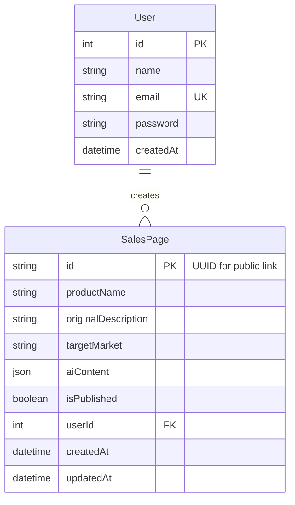

# AI Sales Page Generator - Entity Relationship Diagram

## 1. Database Choice

- **Database:** PostgreSQL (local development)
- **ORM:** Prisma
- **Relationship:** One `User` has many `SalesPage` records

## 2. Mermaid ERD

## 3. Prisma Schema Reference (Planned)

### User
- `id`: Int, primary key, auto increment
- `name`: String
- `email`: String, unique
- `password`: String (hashed)
- `createdAt`: DateTime, default now
- `salesPages`: Relation to `SalesPage[]`

### SalesPage
- `id`: String UUID, primary key (public identifier)
- `productName`: String
- `originalDescription`: String
- `targetMarket`: String
- `aiContent`: Json
- `isPublished`: Boolean, default false
- `userId`: Int, foreign key to `User.id`
- `createdAt`: DateTime, default now
- `updatedAt`: DateTime, auto update timestamp

## 4. Integrity Rules

- `User.email` must be unique.
- `SalesPage.userId` must reference an existing `User`.
- Deleting a user should cascade-delete owned sales pages (recommended for MVP simplicity).
- Public access is based on `SalesPage.id` and `isPublished = true`.

    }